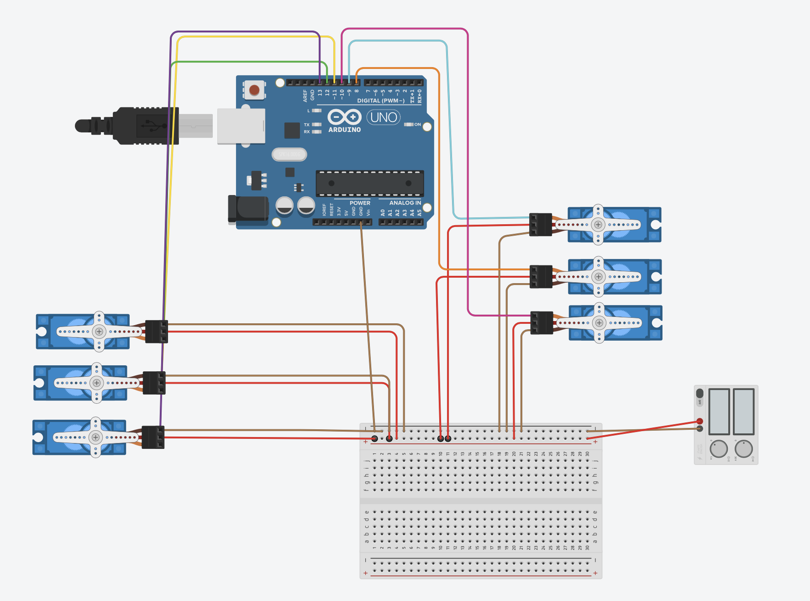

# 6_moters_circuit

## Discription

this project was made to create a circuit  to control two arm with 6 servo motors 3 for each arm 
it has three gestures 
- Hi move
- Bye move 
- Extra move  

to see the simulation [click here](https://www.tinkercad.com/things/2LESonZFCFS)

## Components
- Arduino Uno R3
- 6 Micro Servos 
- 5v Power Supply 

## Code 
[Here](6_motors1.ino)
